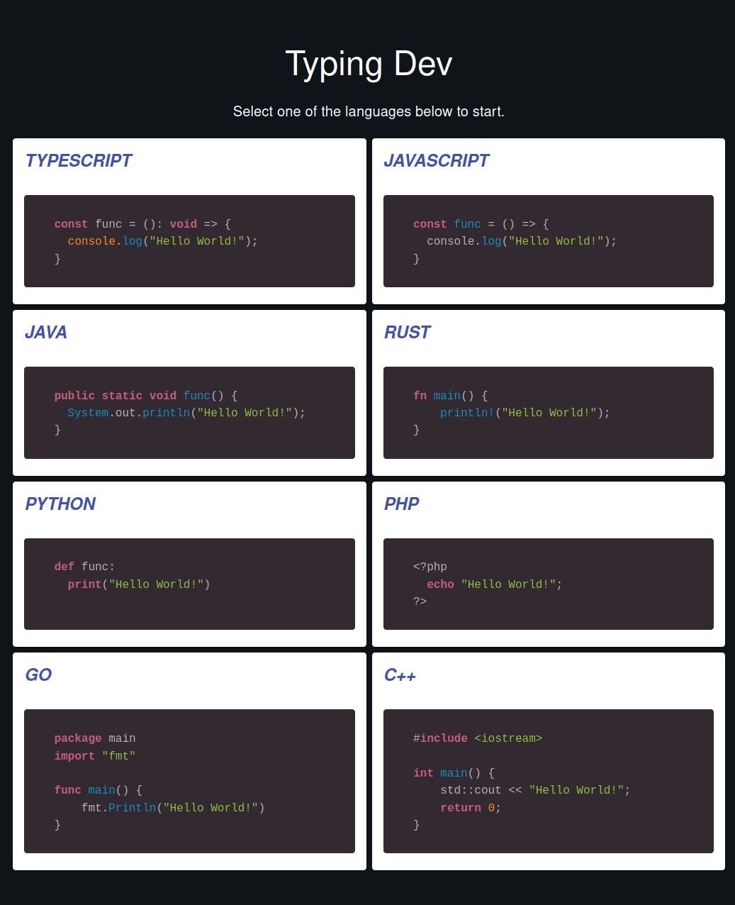
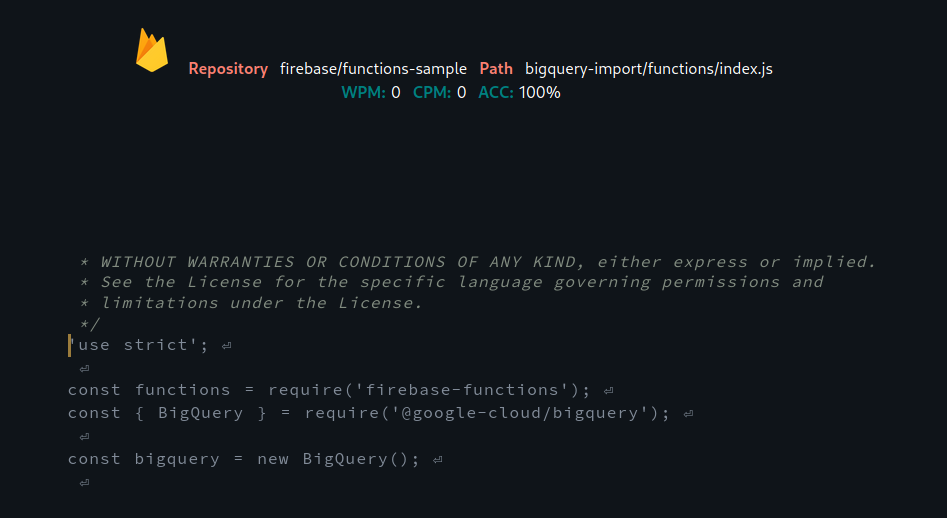

# Type Dev
A [Typing Practice](https://type-dev-5e193.web.app/) web app  

# Motivation
Typical typing practice softwares utilize generic passages to construct their lessons. Although one can improve using such contents, programmers may find it less effective due to the nature of the phrases and characters that they use (ex: all the brackets and those annoying semicolons)  
 
Type-Dev is designed to solve that problem, by pulling in quality code across Github and put them at your fingertips. The process is completely random, and is designed to efficiently get the files that match the language you indicate.

# Features
- A wide selection of programming languages:
  

- A clean interface that needs no introduction
  

- Handy keyboard shortcuts
  - Ctrl+Enter: Focus
  - Ctrl+Shift+Enter: Return to Selection Screen
- Like Turbo Tax, it's Free Free Free

# Note
Due to the rate limit of the Github Search API, reloading the page multiple time to get new code/projects is not ideal. However, I have implemented a cache to pull past code's URL and fetch the file to ensure the state of the content and avoid abusing the limit.